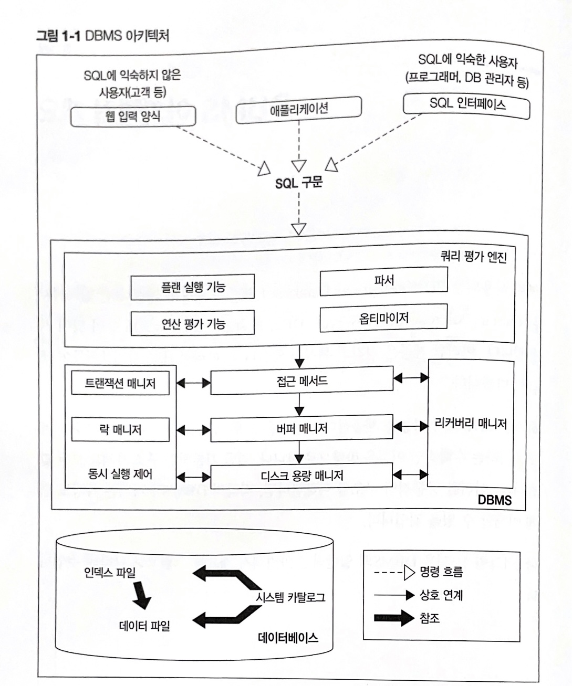
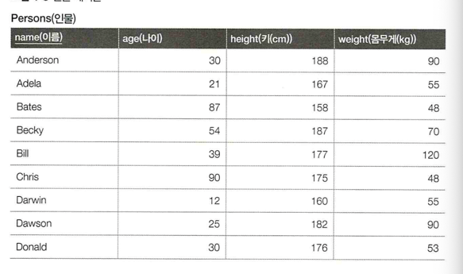
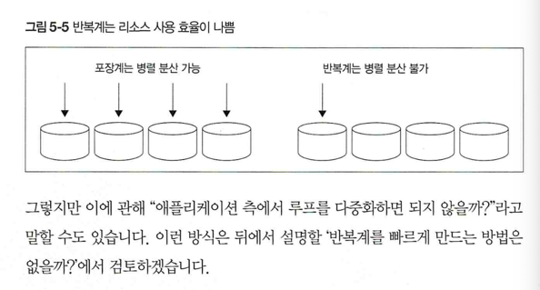
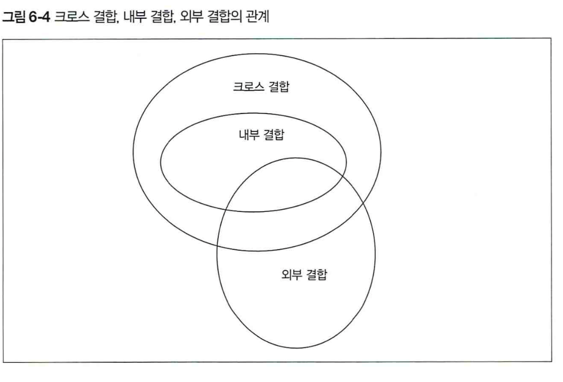
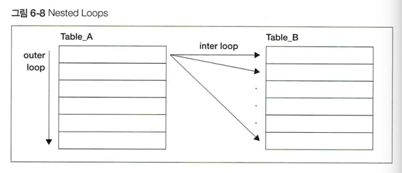
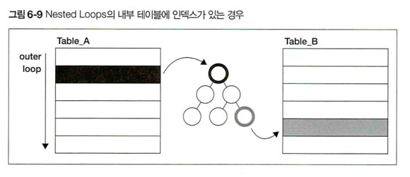
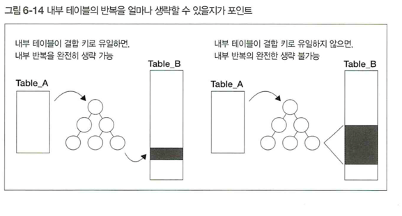
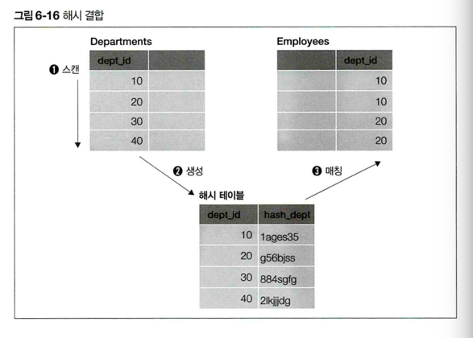
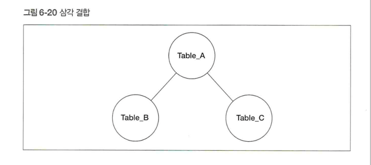
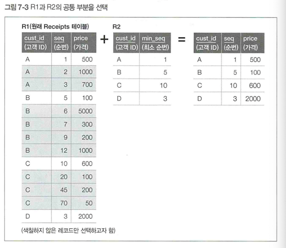

# 구성

## 1장 : DBMS 아키텍처

- RDB의 내부 동작 모델 이해
- 데이터 캐시 또는 워킹 메모리등의 메모리 관련 구조, 저장소 구조.
- SQL 퍼포먼스 이해하기 위한 핵심 개념인 실행 계획과, 실행계획을 만드는 옵티마이저

## 2장 : SQL 기초

- SQL기초 구문

## 3장 : SQL의 조건 분기

- case식을 사용했을 때 어떻게 성능이 변화하는지 실행 계획등을 통해 알아보기

## 4장 : 집약과 자르기

- SQL 집합 지향이라는 패러다임을 GROUP BY 구문과 집약 함수를 통해 살펴보기
- 이전 장에서 배운 CASE식을 활용해 집합 지향적인 SQL구문을 어떻게 만드는지, 성능변화도 알아보기.

## 5장 : 반복문

- RDB의 성능 문제를 발생시키는 원인 중 하나로 SQL이라는 집합 지향 세계에 절차지향적인 패러다임을 적용하려는 시도.
- 반복을 적용하는 것에 대한 문제

## 6장 : 결합

- SQL 성능 문제는 대부분 결합과 관련된 부분에서 발행
- Nested Loops, Hash, SortMerge와 같은 결합 알고리즘의 실행 계획 살펴보고, RDB가 결합을 최적화하려면 어떻게 해야 하는지.

## 7장 : 서브쿼리

- 문제를 작게 분할하고 단계적으로 해결하는 서브쿼리의 접근법은 절차지향적 프로그래밍과 비슷
- 이러한 접근법에 의존하게 되었을 때 발생하는 성능문제

## 8장 : SQL의 순서

- 절차지향적인 기능을 받아들이는 변화. -> 윈도우 함수

## 9장 : 갱신과 데이터 모델

- 데이터 모델 자체를 바꾸는 것이 성능 개선의 가장 좋은 수단

## 10장 : 인덱스 사용

- 어떤 조건에서 인덱스가 유용한지
- 조건을 만들어내기위한 데이터 모델과 사용자 인터페이스 설계 알아보기

# 1장 DBMS 아키텍처

## 01강 DBMS 아키텍처 개요

- 여러 RDB는 결국 **관계 모델**이라는 수학적 이론을 바탕으로 함
- 일반적인 DBMS 아키텍처 개요
  
- DBMS 내부에 다양한 처리를 하는 기능이 있음

### 1. 쿼리 평가 엔진

- 쿼리 평가 엔진은 입력받은 SQL문을 분석하고, 어떤 순서로 기억장치의 데이터에 접근할지를 결정
- 이때 결정되는 계획을 **실행 계획**이라고 부름
- 이 실행 계획에 기반을 둬서 데이터에 접근하는 방법을 **접근 메서드**라고 함
- 성능과 깊은 연관
- cf) 쿼리는 좁은의미로 SELECT구문, 큰 의미로 SQL 구문 전체 의미. 이 책에서 쿼리는 SELECT

### 2. 버퍼 매니저

- DBMS는 버퍼라는 특별한 용도로 사용하는 메모리 영역을 확보해둠
- 이 메모리 영역을 관리하는 것이 버퍼 매니저
- 디스크를 관리하는 디스크 용량 매니저와 함께 연동되어 작동
- 성능과 연관

### 3. 디스크 용량 매니저

- 어디에 어떻게 데이터를 저장할지 관리, 데이터의 읽고 쓰기를 제어

### 4. 트랜잭션 매니저와 락 매니저

- 각 요청 처리는 DBMS 내부에서 트랜잭션이라는 단위로 관리됨
- 필요한 경우 데이터에 락을 걸어 다른 사람의 요청을 대기시키는 것이 트랜잭션 매니저와 락 매니저의 역할
- -> 여러 구문을 동시에 실행할 때 성능과 관련

### 5. 리커버리 매니저

- 절대 잃어버리면 안되는 데이터를 위해 정기적으로 백업, 문제 시 복구해야하는데
- -> 이러한 기능을 수행하는 것이 리커버리 매니저.

## 2강 DBMS와 버퍼

- 데이터를 버퍼에 어떠한 식으로 확보할 것인가 하는 부분에서 트레이드 오프

### 1. 공짜 밥은 존재할까?

- 많은 데이터를 영속적으로 저장하려하면 속도를 잃고
- 속도를 얻고자하면 많은 데이터를 영속적으로 저장하기 힘든 트레이드 오프가 발생

### 2. DBMS와 기억장치의 관계

- DBMS는 데이터 저장을 목적으로 하는 미들웨어
- DBMS가 사용하는 대표적인 기억장치는 하드디스크와, 메모리

#### 버퍼를 이용한 속도 향상

- DBMS가 일부라도 데이터를 메모리에 올리는 것은 성능 향상 떄문
- -> 자주 접근하는 데이터를 메모리 위에 올려둔다면, 같은 SQL 구문을 실행한다고 해도
- -> 디스크에서 데이터를 가져올 필요 없이 곧바로 메모리에서 읽어 데이터를 검색
- -> 디스크 접근을 줄일 수 있다면 굉장히 큰 폭의 성능향상
- -> SQL구문의 실행시간 대부분을 저장소 I/O에 사용하기 떄문
- -> 이렇게 성능향상을 목적으로 데이터를 저장하는 메모리를 **버퍼** 또는 **캐시**라고 함
- -> **버퍼에 데이터를 어떻게, 어느 정도 기간동안 올릴지 관리**하는 것이 DBMS의 버퍼 매니저.

### 3. 메모리 위에 있는 두 개의 버퍼

- DBMS가 데이터를 유지하기 위해 사용하는 메모리 영역은 크게 다음과 같이 두 종류
- 데이터 캐시
- 로그 버퍼
- -> 위 메모리 영역은 사용자가 용도에 따라 크기를 변경하는 것이 가능

#### 데이터 캐시

- 데이터 캐시는 디스크에 있는 데이터의 일부를 메모리에 유지하기 위해 사용
- -> 실행한 SELECT 구문에서 선택하고 싶은 데이터가 데이터 캐시에 있다면
- -> 디스크에 접근하지 않고 처리가 수행됨.

#### 로그 버퍼

- 로그 버퍼는 갱신처리 (INSERT, DELETE, UPDATE, MERGE)와 관련 있음
- DBMS는 갱신과 관련된 SQL구문을 받으면 곧바로 저장소에 있는 데이터를 변경하지 않음
- -> 일단 로그 버퍼 위에 변경정보를 보내고, 이후 디스크에 변경을 수행
- -> COMMIT 때 로그버퍼로부터 디스크로 정보를 복사
- -> 이처럼 DB갱신처리는 SQL구문의 실행 시점과 저장소 갱신시점에 차이가 있는 비동기 처리임
- -> 저장소 변경이 끝날 때까지 기다리면 사용자는 장기간 대기
- -> 따라서 한 번 메모리에 갱신 정보를 받은 시점에서 사용자에게는 해당 SQL 구문이 끝났다라고 통지하고 내부적으로 처리 계속 수행.

### 4. 메모리의 성질이 초래하는 트레이드 오프

- 메모리의 단점들
- 휘발성
- -> 로그 버퍼 위에 존재하는 데이터가 사라져 버릴 수도 있음
- -> 따라서 DBMS는 커밋 시점에 반드시 갱신 정보를 로그파일(영속적 저장소에 존재)에 씀으로써,
- -> 장애가 발생해도 정합성을 유지할 수 있게 함.
- **커밋**이란 갱신처리를 "확정"하는 것.
- DBMS는 커밋된 데이터를 영속화 한다.
- -> 커밋때 반드시 디스크에 동기 접근이 일어남. -> 지연 발생 가능성

### 5. 시스템 특성에 따른 트레이드 오프

#### 데이터 캐시와 로그 버퍼의 크기

- -> 로그버퍼의 초깃값이 굉장히 작음
- -> 데이터베이스가 기본적으로 검색을 메인으로 처리한다고 가정하기 때문
- -> 갱신이 많은 시스템이라면 로그 버퍼의 크기를 늘려주는 튜닝 고려 가능

### 6. 추가적인 메모리 영역 '워킹 메모리'

#### 언제 사용될까?

- 위의 2개의 버퍼 이외에도, 일반적으로 메모리 영역을 하나 더 갖고 있음
- 워킹 메모리 : 정렬 또는 해시 관련 처리.
- 정렬 : order by 구, 집합 연산, 윈도우 함수 등의 기능 사용할 때
- 해시 : 테이블 등 결합에서 해시 결합 사용될 때
- -> 워킹 메모리는 sql에서 정렬 또느 해시가 필요한 때 사용되고 종료되면 해제되는 임시 영역.

#### 성능 이슈 주의

- 워킹 메모리가 다두려는 데이터양보다 부족해지는 경우가 생기면
- 대부분의 DBMS가 디스크 저장소를 사용하기 때문. -> 접근 속도가 느림

#### 부족하면 무슨일이 일어날까?

- 워킹 메모리는 여러개의 SQL 구문들이 공유해서 사용하므로,
- -> 부하검사 등을 실시하지 않으면 메모리 부족현상이 일어날 지 판별하기 힘듬.
- -> sql 구분 하나 있을 때 뿐만아니라, 여러개 있을 때도 주의해야하므로 컨트롤이 힘듬

## 3강 DBMS와 실행 계획

### 1. 권한 이양의 죄악

- 비절차적인 RDB는 절차(HOW)에 대한 일을 사용자가 아니라 시스템에 맡겼음
- -> 사용자가 하는 일은 대상(What)을 기술하는 것으로 축소 됨.
- -> How를 의식하지 않고 사용하므로 어려움이 있음 -> 내부 절차를 알아야하는 이유

### 2. 데이터에 접근하는 방법은 어떻게 결정할까?

- RDB에서 **데이터 접근 절차를 결정**하는 모듈은 **쿼리 평가 엔진**이라고 함.
- 쿼리 평가 엔진은 사용자로부터 입력받은 SQL구문을 처음 읽어들이는 모듈
- -> 쿼리 평가 모듈은 추가로 파서 또는 옵티마이저와 같은 여러개의 서브 모듈로 구성
  

#### 파서 (parser)

- 파서의 역할은 파스(구문분석)하는 것.
- 사용자로부터 입력받은 SQL 문법이 올바른지 검사
- -> 또한 파서는, SQL 구문을 정형적인 형식으로 변환해줌. -> DBMS 내부 후속처리가 효율화됨

#### 옵티마이저(optimizer)

- 파서를 통과한 쿼리는 옵티마이저로 전송됨.
- -> **옵티마이저는 실행계획(데이터 접근법)을 최적화**함.
- 인덱스의 유무, 데이터 분산 또는 편향 정도, DBMS 내부 매개변수 등
- -> 조건을 고려해서 선택가능한 많은 실행계획을 작성하고 (플랜 생성)
- -> 이들의 비용을 연산하고 (비용 평가)
- -> 가장 낮은 비용을 가진 실행계획을 선택함.(플랜 평가)

#### 카탈로그 매니저

- 옵티마이저 실행계획을 세울 때 옵티마이저에게 중요 정보를 제공하는 것이 카탈로그 매니저
- -> **카탈로그란 DBMS 내부 정보를 모아 놓은 테이블**들로 테이블 또는 인덱스의 통계정보가 저장되어 있음
- -> 카탈로그 정보를 간단하게 '통계 정보'라고 부르기도 함.

#### 플랜 평가

- 옵티마이저가 SQL 구문에서 여러개의 실행 계획을 세운 뒤
- -> 그것을 받아 **최적의 실행 결과를 선택**하는 것이 플랜 평가.
- -> **실행 계획**은 DBMS가 곧바로 실행할 수 있는 코드가 아님
- -> 인간이 읽기 쉽게 만들어진 계획서.
- -> 성능이 좋지 않은 SQL 구문이 있을 때 실행 계획을 읽고, 수정방안 등을 고려 가능.
- -> 이렇게 하나의 실행 계획을 선택하면 DBMS는 실행 계획을 절차적인 코드로 변환하고 데이터 접근을 수행함.

### 3. 옵티마이저와 통계 정보

- 카탈로그 매니저가 관리하는 통계정보에 대해서는 DB엔지니어가 항상 신경 써줘야함.
- 플랜 선택을 옵티마이저에게 맡기는 경우, 최적 플랜이 선택되지 않는 경우가 있음.
- -> 옵티마이저가 실패하는 패턴 중 하나는, 통계정보가 부족한 경우

#### 카탈로그에 포함되어 있는 통계정보

- 각 테이블의 레코드 수
- 각 테이블의 필드 수와 필드의 크기
- 필드의 카디널리티(값의 개수)
- 필드값의 히스토그램(어떤 값이 얼마나 분포되어 있는가)
- 필드 내부에 있는 NULL 수
- 인덱스 정보
- -> 이러한 정보를 활용함으로써 옵티마이저는 실행 계획을 만듬
- -> 문제가 생기는 경우는 이러한 카탈로그 정보가 테이블 또는 인덱스의 실제와 일치하지 않을 때
- -> 테이블에 데이터 변경이 있을 때 카탈로그 정보가 갱신되지 않으면,
- -> 옵티마이저는 오래된 정보로 실행계획을 세움.

### 4. 최적의 실행 계획이 작성되게 하려면

- 올바른 통계 정보가 모이는 것은 SQL 성능에 있어서 굉장히 중요한 문제.
- 수동갱신 뿐 아니라, 정기적, 자동 통계정보갱신 수행하기도 함.
- 통계정보 갱신은 테이블, 인덱스의 크기와 수에 따라서 몇십분에서 몇시간이 소요되기도 하는
- 비용이 굉장히 높은 작업.
- DBMS마다 통계정보갱신 명령어가 있음.

## 4강 실행 계획이 SQL 구문의 성능을 결정

- 통계정보가 최신이라도 SQL구문이 너무 복잡하면 옵티마이저가 최적의 접근 경로를 선택하지 못할 수도 있음

### 1. 실행계획 확인 방법

- SQL 구문의 지연이 발생했을 때 제일 먼저 실행 계획을 살펴보기
- 오라클 : set autotrace traceonly
- Oracle과 SQLServer는 실행 계획 확인 명령어 이후 대상 SQL 구문을 실행함.
- (확인 명령과 SQL 구문 사이 개행 들어가도 상솬겂음)

#### 기본적인 SQL구문의 실행계획 3가지

- 테이블 풀 스캔의 실행 계획
- 인덱스 스캔의 실행 계획
- 간단한 테이블 결합의 실행 계획

### 2. 테이블 풀 스캔의 실행 계획

- 레코드 전체 검색하는 단순한 SQL 구문의 실행계획 살펴보기

```sql
SELECT *
FROM Shops;
```

- **DBMS 실행 계획 출력 시 공통으로 나타나는 부분 3가지**
- -> 1 조작 대상 객체
- -> 2 객체에 대한 조작의 종류
- -> 3 조작 대상이 되는 레코드 수

#### 1 조작 대상 객체

- Name 필드에 Shops 테이블이 출력됨.
- -> 이부분은 테이블 이외에도 인덱스, 파티션, 시퀀스처럼 SQL 구문으로 조작할 수 있는 객체라면 무엇이라도 올 수 있음.

#### 2 객체에 대한 조작의 종류

- Operation 필드에 출력됨
- -> TABLE ACCESS FULL은 테이블의 데이터를 전부 읽어들인다는 의미.

##### cf) 실행 계획의 실행 비용과 실행 시간

- 실행 계획의 실행 비용(Cost)는 평가하기 어려운 항목임
- 절대 평가의 지표로 쓰는 것은 곤란.
- Time 필드도 추정시간이므로 절대 지표로 사용 불가
- 실제 구문의 실행 시간은 (DBMS_XPLAN.DISPLAY_CURSOR)
- 위 실행 결과 각각의 필드의 의미
- -> E-Rows : 추정되는 조작 레코드 수
- -> A-Rows : 실제 조작 레코드 수
- -> A-Time : 실제 실행 시간

#### 3 조작 대상이 되는 레코드 수

- Rows라는 항목에 출력 됨
- 결합 또는 집약이 포함되면 1개의 SQL 구문을 실행해도 여러개의 조작이 수행됨
- -> 얼마의 레코드가 처리되는지가 비용 파악의 중요한 지표
- **위 결과들은 카탈로그 매니저로부터 얻은 값**들임!
- 실제 구문을 실행한 시점의 테이블 레코드 수와 차이가 있을 수 있음.

### 3. 인덱스 스캔의 실행 계획

```sql
SELECT *
FROM Shops
WHERE shop_id = '00050';
-- 결과
SELECT STATEMENT TABLE ACCESS BY INDEX ROWID
        INDEX UNIQUE SCAN
```

#### 실행계획 분석

##### 1. 조작 대상이 되는 레코드 수

- 기본키가 '00050'인 점포를 지정했으므로 접근 대상은 반드시 레코드 하나 -> Rows 1

##### 2, 3. 접근 대상 객체와 조작

- 인덱스를 사용해 스캔을 수행

### 4. 간단한 테이블 결합의 실행 계획

- SQL에서 지연이 일어나는 경우는 대부분 결합과 관련된 것.
- 결합을 사용하면 실행계획이 상당히 복잡해지므로, 옵티마이저도 최적의 실행계획을 세우기가 어려움
- **결합시점의 실행계획 특성을 파악하는 것이 중요**

```sql
SELECT shop_name
FROM Shops S INNER JOINE Reservations R
ON S.shop_id = R.shop_id;
```

#### 결합 알고리즘 3가지

##### 1. Nested Loops

- 한쪽 테이블을 읽으면서 레코드하나마다 결합조건에 맞는 레코드를 다른 테이블에서 찾는 방식
- 절차지향형언어로 구현한다면, 이중 반복이므로 중첩반복이라는 이름이 붙은것

##### 2. Sort Merge

- 결합키(shop_id)로 레코드를 정렬하고, 순차적으로 두 개의 테이블을 결합
- 결합 전에 전처리로 정렬을 수행하는데, 이때 작업용 메모리로 워킹 메모리를 사용

##### 3. Hash

- 결합키값을 해시값으로 매핑하는 방법
- -> 해시 테이블을 만들어야하므로 작업용 메모리 영역을 필요로 함.

#### 결합 실행 계획 살펴보기

```sql
SELECT STATEMENT
           NESTED LOOPS TABLE ACCESS FULL                | RESERVATIONS
            TABLE ACCESS BY INDEX ROWID  | SHOPS
                INDEX UNIQUE SCAN        | PK_SHOPS
```

- Opration 필드를 보면 NESTED LOOPS라고 나오므로 어떤 알고리즘 사용한지 알 수 있음
- 실행계획은 일반적으로 트리구조. **중첩단계가 깊을수록 먼저 실행**.
- Nested Loop 보다도
- Seq Scan과 Index Scan의 단계가 깊으므로 결합 전에 테이블 접근이 먼저 수행.
- **같은 중첩 단계에서는 위에서 아래로 실행됨**
- Reservation 테이블에 대한 접근이 위에 있으므로 Reservation에 접근 먼저 일어남


## 5강 실행 계획의 중요성

- 옵티마이저 결과가 좋지 않을 경우가 있음
- 인덱스를 사용하지 않거나, 테이블 결합 순서를 이상하게 적거나.
- -> 최후의 튜닝 수단으로 실행 계획 수동 변경할 수 있음.
- -> 힌트를 하용하면 옵티마이저에게 강제 명령.
- 일행 계획을 변경하려면 어떤 선택지가 있는지 알아야함.
- -> 그러나 그 전에 SQL 구문이 어떠한 접근경로(access path)로 데이터를 검색하는지 아는지가 먼저
- -> 어떤 테이블 설정이 효율적인지, 어떤 SQL 구문이 주어졌을 때 어떠한 실행계획이 나올지도 예측할 수 있어야함.

### cf) DBMS 캐시 알고리즘

- 불특정 다수의 사용자로부터 요구되는 데이터의 캐시 히트율을 올리고 싶을 때,
- 어떤 데이터를 캐시하는 것이 좋을지 기계적으로 풀기위한 알고리즘은 LRU(Least Recently Used)
- 참조 빈도가 가장 적은 것을 캐시에서 버리는 알고리즘

### cf) 다양한 캐시

- 데이터베이스에 메모리를 너무 많이 할당해버리면, 물리 메모리가 고갈되어 운영체제에서 스왑이 일어날 수도 있음.
- 데이터베이스에 메모리를 얼마나 할당할지 판단할 때는 어디까지나 물리 메모리의 범위ㅔ서 가능한 많이

# 2장 SQL 기초

- RDB는 데이터를 관계(relation)이라는 형식으로 저장함.
- -> 구현으로는 이를 테이블이라고 부름.

## 6강 SELECT 구문

- 검색. 다른 말로는 질의(query), 추츨(retrieve)

### 1. SELECT 구와 FROM 구

- SELECT구문은 SELECT구와 FROM구 두부분으로 나누어짐.
- FROM구는 반드시 입력해야하는 것은 아니지만, 테이블에서 검색하는 경우에는 반드시 입력.
- -> 'SELECT 1' 처럼 상수를 선택하는 경우 FROM 안씀.

### 2. WHERE 구

- 이떄의 WHERE는 ~라는 경우 를 나타내는 '관게부사'

#### WHERE 구는 거대한 벤다이어그램


- WHERE 구는 벤다이어그램을 그리기 위한 도구.

#### IN으로 OR 조건 간단하게 작성

```sql
SELECT name, address
FROM Address
WHERE address IN ('서울시', '부산시', '인천시');
```

#### NULL - 아무것도 아니라는 것은 무엇일까?

- WHERE구로 조건을 지정할때, 초보자가 곤란해하는 부분이 NULL을 검색할 때
- -> NULL 레코드를 선택할 때는 IS NULL 이라는 특별한 키워드 사용
- -> NULL 이 아닌 레코드는 IS NOT NULL.
- --> **NULL은 데이터값이 아니므로**, 데이터값에 적용하는 연산자(=)를 적용할 수 없음!

```sql
SELECT name, phone_nbr
FROM Address
WHERE phone_nbr IS NULL;
```

#### SELECT 구문은 절차 지향형 언어의 함수

- SELECT 구문은 일종의 '읽기 전용'함수
- -> SELECT 구문의 입력과 출력 **자료형**은 무엇일까?
- -> 답은 **테이블(관계)**
- -> 입력과 출력도 모두 2차원 표.
- -> 이러한 성질 때문에 관계가 닫혀있다는 의미로 폐쇄성(closure property)라고 부름
- -> 뷰와 서브쿼리를 함께 이해할 때는 이러한 개념이 굉장이 중요 !
  

### 3. GROUP BY 구 -> 집계함수 사용 가능

- GROUP BY를 사용하면 데이터 선택 뿐만아니라,
- -> 합계 또는 평균등의 **집계 연산**을 SQL 구문으로 할 수 있음
- -> GROUP BY 구는 테이블을 홀케이크처럼 다룬다 개념
- -> 케이크를 자를 때의 **기준은 필드**
- -> **잘라진 조각은 그룹**이라고 부름. **그룹은 집계함수 사용**이 가능.
- COUNT, SUM, AVG, MAX, MIN
- 조각으로 자르고 싶지 않다면
- -> GROUP BY 구문에 키를 지정X

```SQL
SELECT COUNT(*)
FROM Address
GROUP BY (); -- 생략은 가능하나 원칙은 GROUP BY문이 있어야 집계함수 가능.
```

### 4. HAVING 구

- 결과 집합에 또다시 조건을 걸어 선택하는 기능
- **WHERE 구가 '레코드'에 조건을 지정**한다면, **HAVING구는 '집합'에 조건을 지정**하는 기능.
- HAVING 절은 그룹화된 결과에 대한 조건을 검사하므로, 
- -> 그룹화된 열 (group by 대상 혹은 집약함수 대상) 에 대한 조건을 지정해야 합니다. 
- -> WHERE 절은 개별 행에 대한 조건을 지정하는 반면, 
- -> HAVING 절은 그룹화된 결과에 대한 조건을 지정합니다.

```SQL
SELECT address, COUNT(*)
FROM Address
GROUP BY address
HAVING COUNT(*) = 1;
```

### 5. ORDER BY 구

- ORDER BY구가 없는 SELECT문은 순서가 정해진 규칙이 없음
- 순서를 보장하려면 명시적으로 순서를 지정해야함.

### 6. 뷰와 서브쿼리

- SELECT 구문을 데이터베이스 안에 저장하는 것이 -> 뷰(View)
- 뷰는 데이터베이스 안에 저장한다는 점에 테이블과 공통점이 있지만
- 테이블과 달리 뷰는 내붑에 데이터를 보유하지 않음. -> SELECT구문을 저장한 것.

```sql
CREATE VIEW 뷰이름 (필드이름1, 필드이름2 ...) AS
SELECT
...
```

```sql
-- 주소별 사람수를 구하는 SELECT구문을 뷰로 저장

CREATE VIEW CountAddress (v_address, cnt)
AS
SELECT address, COUNT(*)
FROM Address
GROUP BY address;

-- 사용 예시
SELECT v_address, cnt
FROM CountAddress -- 테이블 대신 뷰를 FROM구에 지정
```

- 위처럼 뷰라는 것은 '테이블의 모습을 한 SELECT 구문'
- 실제로는 내부적으로 추가적인 SELECT 구문을 실행하는 중첩 구조

#### 익명 뷰 (== 서브쿼리)
```sql
-- 뷰의 실제 내부 코드
SELECT v_address, cnt
FROM (SELECT address AS v_address, COUNT(*) AS cnt
      FROM Address
      GROUP BY address) AS CountAddress;
```
- 위처럼 **FROM구에 직접 지정하는 SELECT구문을 서브쿼리**라고 부름.

#### 서브쿼리를 사용한 편리한 조건 지정 (매칭 사용)
- 서브쿼리를 사용할 때 중요한 것 
- -> **WHERE구의 조건에 서브쿼리를 사용**하는 방법. --> **매칭**
- 서로다른 테이블에 있는 공통된 데이터를 선택
- -> Address 테이블에서 Address2 테이블에 있는 사람을선택 -> 매칭
- -> 이런경우 IN 조건을 활용가능 -> **IN은 서브쿼리를 매개변수로 받을 수도 있음!**

```sql
SELECT name 
    FROM Address
WHERE name IN (SELECT name FROM Address2);
```
- -> SQL은 서브쿼리부터 순서대로 실행 
- -> 앞의 SELECT 구문은 서브쿼리를 상수로 전개구문이 바뀌는 것
```sql
SELECT name 
    FROM Address
    WHERE name IN ('인성', '민', '준서', '지연', '서준', '중진')
```
- -> 동적으로 상수 리스트 생성하여 데이터 수정되어도 하드코딩 필요 없음

## 7강 조건 분기, 집합 연산, 윈도우 함수, 갱신

### 1. SQL과 조건 분기 - CASE식
- SQL에도 조건 분기를 하는 방법이 있지만 사용방법이 다름
- SQL은 코드를 절차적으로 기술하는것이 아니므로 조건 분기를 '문장'단위로 하지 않기 떄문
- -> SQL의 조건 분기는 "식"으로 분기를 함. -> **CASE 식**
- CASE식은 단순 CASE식과 **검색 CASE식** 두 종류가 있음.
- -> 검색 CASE식은 단순 CASE식의 기능을 모두 포함하므로 검색 CASE만 기억해도 충분
```sql
CASE WHEN [평가식] THEN [식]
    WHEN [평가식] THEN [식]
    WHEN [평가식] THEN [식]
    생략
    ELSE [식]
END
``` 
####  CASE식의 작동
- switch 조건문과 거의 비슷
- **CASE문은 특정한 값(상수)를 리턴**하는 것이 차이점
- CASE식의 강력한 점은 **식**이라는 것
- -> 식을 적을 수 있는 곳이라면 어디든 적을 수 있음
- SELECT, WHERE, GROUP BY, HAVING, ORDER BY 구와 같은 곳 어디에나 적을 수 있음.

### 2. SQL의 집합 연산 - UNION & INTERSECT & EXCEPT
- WHERE 구를 설명할 때 벤다이어그램을 사용한 집한 연산으로 예를 들었지만
- -> 테이블을 사용해 **집합 연산**을 하는 기능 -> **UNION**

#### UNION으로 합집합 구하기
- 중복된 레코드는 제거됨!
- -> 중복 제외하고 싶지 않으면 'UNION ALL'
```sql
SELECT * 
    FROM Address
UNION
SELECT *
    FROM Address2;
```

#### INTERSECT로 교집합 구하기
```sql
SELECT * 
    FROM Address
INTERSECT 
SELECT *
    FROM Address2;
```
- -> 양쪽에 공통으로 존재하는 레코드(로우)출력
- -> 마찬가지로 중복은 제거된 것임.

#### EXCEPT로 차집합 구하기 (오라클은 MINUS)
```sql
SELECT * 
    FROM Address
EXCEPT 
SELECT *
    FROM Address2;
```
- EXCEPT는 UNION과 INTERSECT와는 다르게, 
- -> 작성할 때 테이블 순서에 따라 결과가 다름
- 1-5 와 5-1이 다른 것과 같은 이치. (교환법칙 성립하지 않음)

### 3. 윈도우 함수
- 윈도우 함수는 데이터를 가공하게 해준다는점에서도 중요하지만 성능과도 큰 관계가 있음
- **윈도우 함수의 특징**은 한마디로 **집약 기능이 없는 GROUP BY 구**
- -> **GROUP BY구는 자르기와 집약**이라는 두 개의 기능으로 구분됨
- -> **윈도우 함수는 자르기 기능만** 있는 것.
```sql
SELECT address, COUNT(*)
    FROM Address
    GROUP BY address;

-- 결과
address  | count 
----------------
서울시     | 3
인천시     | 2
부산시     | 1
```
- 위 GROUP BY는 필드로 테이블을 자르고, 잘라진 조각 개수만큼 레코드수를 더해 결과를 출력
- 윈도우 함수도 테이블을 자르는 것은 GROUP BY와 같음
- 윈도우 함수는 이를 **PARTITION BY** 라는 구로 수행함.
- -> **차이점은 자른 후에 집약하지 않으므로** 출력 결과의 레코드수가 입력되는 테이블의 레코드수와 같다는 것.
- 윈도우 함수의 기본적인 구문은 **집약 함수 뒤에 OVER구를 작성**하고
- -> **내부에 자를 키를 지정하는 PARTITION BY 또는 ORDER BY를 입력**하는 것.
- -> 작성하는 장소는 SELECT구라고만 생각해도 문제없음.
```sql
SELECT address,
       COUNT(*) OVER(PARTITION BY address)
    FROM Address;

-- 결과
-- 결과
address  | count 
----------------
서울시     | 3
서울시     | 3
서울시     | 3
----------------
인천시     | 2
인천시     | 2 
----------------
부산시     | 1
```
#### 윈도우 함수로 사용할 수 있는 함수
- COUNT, SUM 같은 일반 함수
- RANK, ROW_NUMBER 같은 윈도우 전용함수 (순서함수)

### 4. 트랜잭션과 갱신
- 갱신 작업은 삽입, 제거, 갱신의 세종류로 분류
- 의외에도 삽입과 갱신을 합친 머지(MERGE)가 있음
#### INSERT로 데이터 삽입
- RDB에서 데이터를 등록하는 단위는 **레코드(행)**
- 기본적인 등록단위는 하나의 레코드 씩(여러개의 레코드를 한개의 insert구문에 삽입하는 DBMS도 있음)
- -> 이때 사용하는것이 INSERT구문
- -> 문자 그대로 레코드를 삽입.
#### DELETE로 데이터 제거
- 데이터를 삭제할 때는 하나의 레코드 단위가 아니라, 한 번에 여러개의 레코드 단위로 처리
#### UPDATE로 데이터 갱신
```sql
-- UPDATE구문을 한 번 사용해서 갱신
UPDATE Address
    SET phone_nbr = '080-5848-XXXX',
        age = 20
    WHERE name = '빛나래';
```
#### 예제
- Address테이블에서 성별 별로 나이 순위(건너뛰기 있게) 매기는 SELECT구문을 생각
```sql
SELECT name, RANK() OVER (PARTITION BY sex ORDER BY age DESC) rnk_desc 
    FROEM Address;
```

# 3장 SQL의 조건 분기
- CASE식 의외에도 조건 분기에 사용할 수 있는 구문 -> UNION
- 하지만 굉장히 좋지 않은 SQL 구문..
- -> UNION은 조건 분기를 위해 만들어진 것이 아님!
- 많은 사람들이 어떻게 작동할지 쉽게 예측할 수 있다는 이유에서 UNION을 많이 사용함

## 8강 UNION을 사용한 쓸데없이 긴 표현
- UNION을 사용한 조건 분기는 좋지 않음
- WHERE구만 조금씩 다른 여러개의 SELECT구문을 합쳐, 복수의 조건이 일치하는 하나의 결과 집합을 얻고 싶을 때 사용
- -> 성능에서 굉장히 큰 단점 -> 내부적으로 여러개의 SELECT 구문을 실행하는 실행계획으로 해석됨
- -> 테이블 접근 횟수가 많아져서 I/O비용이 크게 늘어남.

### 1. UNION을 사용한 조건 분기와 관련된 간단한 예제
- ex) 2001년까지는 세금이 포함되지 않은 가격을, 2002년부터느 세금 포함 가격을 필드로 표시
```sql
-- UNION을 사용한 안좋은 예시
SELECT item_name, year, price_tax_ex AS price
    FROM Items
    WHERE year <= 2001
UNION ALL 
SELECT item_name, year, price_tax_in AS price
    FROM Items
    WHERE year >= 2002;
```
- 위의 예시는 조건이 배타적이므로 중복된 레코드가 발생되진 않음
- 정렬들의 처리를 하지 않아도 되므로 UNION ALL을 사용
- 쓸데없이 길다는 것이 첫 번째 문제 -> 거의 같은 쿼리 두번 실행.
- 두번째 문제는 성능

#### UNION을 사용했을 떄의 실행 계획 문제
- -> 실행계획을 살펴보면 위의 UNION쿼리는 Items 테이블에 2회 접근하고 있음
- -> 그때마다 TABLE ACCESS FULL이 발생하므로 읽는 비용도 테이블 크기에 따라 선형적으로 증가
- -> 데이터 캐시에 테이블의 데이터가 있으면 완화되겠지만, 테이블이 커지면 캐시 히트율도 낮아짐.

### 2. WHERE 구에서 조건 분기를 하는 사람은 초보자
- 조건분기를 WHERE로 하지말고 **SELECT구만으로 조건 분기**하기
```sql
SELECT item_name, year,
    CASE WHEN year <= 2001 THEN price_tax_ex
        WHEN year >= 2002 THEN price_tax_in END AS price
    FROM Items;
```
- 이 쿼리도 위의 UNION쿼리와 같은 결과를 출력함
- 하지만 성능적으로 이 쿼리가 훨씬 좋음. 

### 3. SELECT 구를 사용한 조건 분기의 실행 계획
- Items 테이블에 대한 접근이 1회로 줄어들어 성능이 2배 좋아진 것임
- 가독성 또한 좋아짐. 
- -> UNION을 사용한 분기는 SELECT 구문을 기본단위로 분기하고 있음
- -> **구문을 기본 단위로 사용하고 있다는 점에서 아직 절차 지향형의 발성을 못벗어남**
- -> 반면, **CASE식을 사용한 분기는 문자 그대로 '식'을 바탕으로하는 사고**

## 9강 집계와 조건 분기
- 집계를 수행하는 쿼리 작성 시 쓸데없이 길어지는 경우 많음
- 지역별로 남녀 인구를 기록하는 Population 테이블
### 1. 집계 대상으로 조건 분기
- 절차지향적 사고방식으로는 남성의 인구를 지역별로 구하고, 여성의 인구를 지역별로 구한 뒤
- 머지하는 방법을 생각할 것임.. (안좋은예)
```sql
-- UNION 
SELECT prefecture, SUM(pop_mem) AS pop_mem, SUM(pop_wom) AS pop_wom
    FROM( SELECT prefecture, pop AS pop_mem, null AS pop_wom
            FROM Population
          WHERE sex = '1'
          UNION
          SELECT prefecture, NULL AS pop_men, pop AS pop_wom
          FROM Population
          WHERE sex = '2') TMP
    GROUP BY prefecture;
```
- -> WHERE 구에서 sex 필드로 분기하고 결과를 UNION으로 머지한다는 절자지향적인 구성이 문제
- -> 테이블 풀스캔 2번 일어남. 

#### 집계의 조건 분기도 CASE식을 사용
- CASE식을 집약함수 내부에 포함시켜서 남성인구와 여성인구 필터를 만들기
```sql
SELECT prefecture,
       SUM(CASE WHEN sex = '1' THEN pop ELSE 0 END) AS pop_men,
       SUM(CASE WHEN sex = '2' THEN pop ELSE 0 END) AS pop_wom
   FROM Population
   GROUP BY prefecture;
```
#### CASE 식의 실행 계획
- 풀스캔 1번으로 줄음


### 2. 집약 결과로 조건 분기
- 집약에 조건 분기를 적용하는 또 하나의 패턴으로, 집약 결과에 조건 분기를 수행
- ex) 조건
- -> 소속된 팀이 1개라면 해당 직원은 팀의 이름을 그대로 출력
- -> 소속된 팀이 2개라면 해당 직원은 '2개를 겸무' 라는 문자열을 출력
- -> 소속된 팀이 3개 이상이라면 해당 직원은 '3개 이상을 겸무' 문자열 출력
#### UNION을 사용한 잘못된 조건 분기
- 조건분기가 레코드 값이 아닌, 집합의 레코드수에 적용됨
- -> 따라서 조건 분기가 WHERE(레코드의 조건) 구가 아니라 HAVING(집합의 조건) 구에 지정
- -> 하지만 UNION으로 머지하고 있는 이상, 구문레벨의 분기일 뿐 WHERE구 사용과 크게 다르지 않음.
```sql
SELECT emp_name,
       MAX(team) AS team
    FROM Employees
    GROUP BY emp_name
    HAVING COUNT(*) = 1
UNION 
SELECT emp_name,
       '2개를 겸무' AS team
    FROM Employees
    GROUP BY emp_name
    HAVING COUNT(*) = 2
UNION
SELECT emp_name
        '3개 이상을 겸무' AS team
    FROM Employees
    GROUP BY emp_name
    HAVING COUNT(*) >= 3;
```
#### UNION의 실행계획
- 테이블 풀스캔 3번

#### CASE 식을 사용한 조건 분기
```sql
SELECT emp_name,
       CASE WHEN COUNT(*) = 1 THEN MAX(team)
            WHEN COUNT(*) = 2 THEN '2개를 겸무'
            WHEN COUNT(*) >= 3 THEN '3개 이상을 겸무'
          END AS team
    FROM Employees
    GROUP BY emp_name;
```
#### CASE식을 사용한 조건 분기의 실행계힉
- -> 테이블 풀스캔 1번 
- -> GROUP BY 해시 연산도 3회에서 1회로 줄어드
- -> 집약결과(COUNT 함수의 리턴값)를 CASE 식의 입력으로 사용했기 때문
- -> **COUNT 또는 SUM과 같은 집약함수의 결과는 1개의 레코드로 압축됨**
- -> 다르게 말하면 **집약함수의 결과는 스칼라 값**(더이상 분할 불가능 값)이 되는 것
- -> 따라서 CASE식의 매개변수에 집약함수를 넣을수 있는 것임. 

## 10강 그래도 UNION이 필요한 경우

### 1. UNION을 사용할 수밖에 없는 경우
- 머지 대상이 되는 SELECT 구문들에서 사용되는 테이블이 다른 경우
- == 여러개의 테이블에서 검색한 결과를 머지하는 경우
```sql
SELECT col_1
    FROM Table_A
    WHERE col_2='A'
UNION ALL 
SELECT col_3
    FROM Table_B
    WHERE col_4 = 'B';
```
- FROM구에 테이블을 결합하면 CASE식을 사용해 원하는 결과를 구할수도 있음
- 하지만 이 상황에선 그렇게하면 필요없는 결합이 발생해서 악영향 발생

### 2. UNION을 사용하는 것이 성능적으로 더 좋은 경우
- UNION이외의 다른 방법으로도 풀 수 있지만, UNION을 사용하는 편이 더 성능이 좋은 경우
- -> **인덱스와 관련된 경우**
- -> UNOIN을 사용했을 때 좋은 인덱스(압축을 잘 하는 인덱스)를 사용하지만,
- -> 이외의 경우에는 테이블 풀스캔이 발생한다면 UNION을 사용한 방법이 성능적으로 더 좋을 수도 있음
- ex)

- 레코드는 (data_n, flas_n이라는 3개의 짝에서 하나의 짝에만 값이 있고, 다른짝은 모두 (null, null))
- -> 테이블에서 date_1~data_3이 특정 날짜(2013-11-01)를 값으로 갖고 있고, 대칭되는 플래그 필드의 값이 'T'인 레코드를 선택할 때, ~~

#### UNION을 사용한 방법
- 위 문제를 UNION을 사용해 해결하면 굉장히 간단함
- -> 3개의 SELECT 구문을 UNION으로 머지하면 됨
```sql
SELECT key, name
    date_1, flg_1,
    date_2, flg_2,
    date_3, flg_3
  FROM ThreeElements
  WHERE date_1 = '2013-11-01'
  AND flg_1 = 'T'
UNION
SELECT key, name
  date_1, flg_1,
  date_2, flg_2,
  date_3, flg_3
FROM ThreeElements
WHERE date_2 = '2013-11-01'
  AND flg_2 = 'T'
UNION
SELECT key, name
  date_1, flg_1,
  date_2, flg_2,
  date_3, flg_3
FROM ThreeElements
WHERE date_3 = '2013-11-01'
  AND flg_3 = 'T'
```
- -> 중요한 것이 성능과 실행계획
- -> 이때 포인트가 인덱스 이 쿼리를 최적의 성능으로 수행하려면 다름과 같은 필드 조합에 인덱스가 필요
```sql
CREATE INDEX IDX_1 ON ThreeElements (date_1, flg_1);
CREATE INDEX IDX_2 ON ThreeElements (date_2, flg_2);
CREATE INDEX IDX_3 ON ThreeElements (date_3, flg_3);
```
- -> WHERE 구에서 (date_n, flg_n)라는 필드 조합을 사용할 때 빠르게 만들어줌
#### UNION의 실행결과 
- 테이블의 레코드 수가 적은경우 테이블 풀스캔이 발생할 수도 있음
- 테이블 크기가 작을 경우 풀스캔과 인덱스스캔이 비슷
- -> 위의 예시의 경우 3개의 select구문 모두 인덱스가 사용되고 있음

#### OR를 사용한 방법
- UNION을 사용하지 않고 푼다면 어떻게? 
- OR조건 사용 예시
```sql
SELECT key, name 
    date_1, flg_1,
    date_2, flg_2,
    date_3, flg_3
  FROM ThreeElements
  WHERE (date_1 = '2013-11-01' AND flg_1 = 'T')
  OR (date_2 = '2013-11-01' AND flg_2 = 'T')
  OR (date_3 = '2013-11-01' AND flg_3 = 'T')
```
#### OR조건 실행계획
- SELECT구문이 하나도 줄어들었기 때문에 테이블에 대한 접근이 1회로 줄어듬
- -> 하지만 테이블 풀스캔으로 수행 
- -> 3회의 인덱스 스캔 VS 1회의 테이블 풀스캔의 문제가 됨
- -> 테이블 크기와 검색조건에 따른 선택비율(레코드 히트율)에 따라 답이 달라짐
- -> 테이블이 크고, WHERE 조건으로 선택되는 레코드 수가 작다면 UNION이 더 빠름

#### IN을 사용한 방법
- OR쿼리를 IN쿼리로 변환
```sql
SELECT key, name,
    date_1, flg_1,
    date_2, flg_2,
    date_3, flg_3
  FROM ThreeElements
  WHERE ('2013-11-01', 'T') //WHERE 대상에 값, IN에 칼럼이 들어갔네.. 
    IN((date_1, flg_1),
      (date_2, flg_2),
      (date_3, flg_3));
```
- -> 위는 다중필드, 또는 행식이라는 기능을 사용한 방법임
- -> IN의 매개변수로는 단순한 스칼라뿐만 아니라,
-> 이렇게 (a, b, c)와 같은 값의 리스트를 입력할 수도 있음.
- -> 하지만 실행계획은 OR와 같음

## 11강 절차 지향형과 선언형
- 몇가지 상황을 제외하면 UNION을 사용하지 않는 것이 성능적으로도 좋고 가독성도 좋음

### 1. 구문 기반과 식 기반
- sql초보자는 절차지향적인 구문 기본
- sql중급자는 선언적인 식기반

### 2. 선언형의 세계로 도약

# 4장 집약과 자르기
- sql의 특징적인 사고방식 중에, 레코드 단위가 아닌,
- 레코드의 '집합'단위로 처리를 기술하는 것이 있음 -> 이러한 사용방식을 집합 지향
- 기본적인 데이터 사고방식 단위를 '레코드'에서 '레코드 집합'으로 변경하려면 어느정도 발상의 전환이 필요


## 12강 집약
- SQL에는 5개의 집약함수 있음 -> 여러 레코드를 하나의 레코드로 집약
- COUNT, SUM, AVG, MAX, MIN

### 1. 여러 개의 레코드를 한 개의 레코드로 직얍
- 비집약 테이블처럼 한 사람과 관련된 정보가 여러 개의 레코드로 분산되어 있을 경우
- -> 집약함수를 사용하여 한개의 레코드로 얻는것이 편하다
#### CASE식과 GROUP BY 응용
- 비집약 테이블에서 집약 테이블로 변환시키기
##### GROUP BY구로 집약했을 떄 SELECT 구에 입력 가능한 세가지
- 상수
- GROUP BY 구에서 사용한 집약키
- 집약 함수
##### 예시
```sql
SELECT id, 
       MAX(CASE WHEN data_type='A'THEN data_1 ELSE NULL END) AS data_1,
       MAX(CASE WHEN data_type='A'THEN data_2 ELSE NULL END) AS data_2,
       MAX(CASE WHEN data_type='B'THEN data_3 ELSE NULL END) AS data_3,
       MAX(CASE WHEN data_type='B'THEN data_4 ELSE NULL END) AS data_4,
       MAX(CASE WHEN data_type='B'THEN data_5 ELSE NULL END) AS data_5,
       MAX(CASE WHEN data_type='C'THEN data_6 ELSE NULL END) AS data_6
    FROM NonAggTbl
    GROUP BY id;
```

#### 집약 -> 해시, 정렬
- 이런 집약 쿼리의 실행 계획은 테이블 풀스캔하고, GROUP BY로 집약수행하는 간단한 실행계획
- -> 주목해야할 부분은 **GROUP BY의 집약 조작에 해시 알고리즘을 사용**하고 있다는 것
- 정렬(SORT)도 사용되고 해시도 사용됨(최근엔 해시 많이 사용)
- -> **해시의 설징 상 GROUP BY의 유일성이 높으면 더 효율적으로 작동**
##### GROUP BY(집약) 시 성능 주의점
- 정렬과 해시 모두 메모리를 많이 사용하므로 충분한 워킹메모리 확보하지 않으면 스왑이 발생

### 2. 합쳐서 하나
- 1개의 레코드로 전체를 커버하지 못해도 여러개의 레코드를 조합해 커버할 수 있다면
- '합쳐서 하나'로 표현할 수 있음
- ex) 호텔 방마다 도착일과 출발일을 기록하는 테이블에서 사람들이 숙박한 날이 10일 이상인 방을 선택하기
```sql
SELECT room_nbr,
       SUM(end_date - start_date) AS working_days
       FROM HotelRooms
       GROUP BY room_nbr
       HAVING SUM(end_date - start_date) >= 10;
```

## 13강 자르기
- GROUP BY 구는 집약 말고도 **자르기**라는 중요한 기능
- -> 이는 원래 모집합인 테이블을 작은 부분 집합들로 분리하는 것임
- -> GROUP BY라는 것은 **자르기**와 **집약**이라는 기능을 한꺼번에 수행하는 것
### 1. 자르기와 파티션

- 일단 사람들의 이름 앞글자를 이용해 명단을 정리
- -> 모집합 Person을 S1 ~ S4의 부분 집합으로 나누고 각각의 부분집합에 몇명의 사람이 있는지 알아보는 작업
```sql
SELECT SUBSTRING(name, 1, 1) AS label,
       COUNT(*)
   FROM Persons
   GROUP BY SUBSTRING(name, 1, 1);
```
- -> 앞글자를 GROUP BY 구의 키로 지정

#### 파티션
- GROUP BY 구로 잘라 만든 하나하나의 부분집합을 수학적으로 **파티션**이라고 부름
- -> **파티션은 서로 중복되는 요소를 가지지 않은 부분 집합!**
```sql
SELECT CASE WHEN age < 20 THEN '어린이'
            WHEN age BETWEEN 20 AND 69 AND '성인'
            WHEN age >= 70 THEN '노인'
            ELSE NULL END AS age_class,
        COUNT(*)
        FROM Persons
      GROUP BY CASE WHEN age < 20 THEN '어린이'
                    WHEN age BETWEEN 20 AND 69 THEN '성인'
                    WHEN age >= 70 THEN '노인'
                    ELSE NULL END;
```
- age_class라는 별칭으로 GROUP BY 사용하는 DB도 있으나 표준아님
- 실행계획 -> GROUP BY 구에서 CASE 식 또는 함수를 사용해도 실행계획에 큰 영향없음
- -> 필드에 연산이 추가된 식을 GROUP BY 구의 키로 한다면 어느정도 CPU 연산에 오버헤드가 걸리긴 할 것임
- -> 이는 데이터를 뽑아온 뒤의 이야기이므로 데이터 접근 경로에는 영향없음
- -> **집약함수와 GROUP BY의 실행계획은 워킹메모리 용량만 주의하면 괜찮음**
### 2. PARTITION BY 구를 사용한 자르기
- GROUP BY 구에서 집약 기능 제외하고 자르는 기능만 남긴것이 윈도우 함수의 PARTITION BY
- 실제로 집약이라는 기능을 제외하면 GROUP BY와 PARTITION BY구의 실질적인 기능엔 차이가 업승ㅁ 
- -> PARTITION BY구를 사용해도 단순 CASE식, 계산식을 이용한 복잡한 기준 사용 가능

###  정리
- GROUP BY 구 또는 윈도우 함수의 PARTITION BY 구는 집합을 자를 떄 사용 
- GROUP BY 구 또는 윈도우 함수는 내부적으로 해시 또는 정렬 처리를 실행
- GROUP BY 구 또는 윈도우 함수와 CASE식을 함께 사용하면 굉장히 다양한 것을 표현 가능


# 5장 반복문 (절차지향형의 속박)
- 집합지향적 사고가 아니라, 절차지향형으로 접근한 최악의 상황 중 하나..

## 14강 반복문 의존증
- 문제를 작게 나누어 레코드라는 단위에 이를떄까지 자르고 그러한 레코드에 반복문을 적용해서 문제를 해결하려는 태도..   

### 1. 내부적으로는 반복문 사용

## 15강 반복계의 공포
- 반복계의 반대는 포장계
### 1. 반복계의 단점
- 성능이 단점 
- -> SQL 실행의 오버헤드
#### SQL 실행의 오버헤드 
- SQL 실행할떄는 데이터를 검색하거나 연산하는 실제의 SQL 처리 이외에도 다양한 처리 이루어짐
- 전처리)
- -> 1. SQL 구문을 네트워크로 전송
- -> 2. 데이터베이스 연결
- -> 3. SQL 구문 파스
- -> 4. SQL 구문의 실행 계획 생성 또는 평가
- 후처리)
- -> 5. 결과집합을 네트워크로 전송
- => 1과 5는 db서버와 애플리케이션 서버가 보통 같은 데이터 센터 내부의 동일 LAN위에 있으므로 오버헤드 거의 없음
- => 2는 DB에 SQL 구문을 실행하기 위한 작업
- -> DB에 연결해서 세션설정하는 처리 -> 커넥션 풀 사용하여 오버헤드 거의 없음
- => 3과4는 오버헤드에 영향 많음 - 특히 3(SQL구문파스-구문분석)이 오버헤드 높음
- -> 파스는 DB가 SQL을 받을 때마다 실행되므로 반복계에서 오버헤드 더 높아짐.

#### 병렬 분산이 힘들다.
- 반복계는 반복 1회마다의 처리를 굉장히 단순화함.
- 리소스를 분산해서 병렬처리하는 최적화가 안됨
- CPU의 멀티코어로 분산처리 할 수 없음, 저장소의 분산효율 낮음
- DB저장소는 대부분 RAID디스크로 I/O부하 분산을 할수 있음
- 반복계에서 실행하는 SQL 구문은 단순해서 1회의 sql 구문이 접근하는 데이터양이 적음
- -> I/O를 병렬화하기 힘들다는 단점

#### 데이터베이스의 진화로 인한 혜택을 받을 수 없음
- 미들웨어 또는 미들웨어의 진화에 따른 혜택을 거의 받을 수 없음
- -> 이러한 성능 효과가 있으려면 sql이 충분히 튜닝되어있다는 전제가 있어야함.
- -> 반복계는 튜닝의 가능성도 거의 없음

### 2. 반복계를 빠르게 만드는 방법은 없을까?
- 1. 반복계를 포장계로 다시 작성.
- 2. 각각의 SQL을 빠르게 수정 -> 유니크 스캔 또는 인덱스 레인지 스캔 정도 뿐 튜닝의 효과를 보기 어려움
- -> INSERT 구문은 SELECT보다 고속화가 더 어려움(실행계획이 단순하기 떄문)
- 3. 다중화 처리
- -> CPU 또는 디스크와 같은 리소스에 여유가 있고 처리를 나눌 수 있는 키가 명확히 정해져 있다면
- -> 처리를 다중화해서 성능을 선형에 가깝게 스케일할 수 있음. 

### 3. 반복계의 장점
- sql 구문이 단순해서 실행계획도 단순 
#### 실행 계획의 안정성
- 실행계획이 단순하다는 것은 해당 실행 계획에 변동 위험이 거의 없다는 것
- 변동이 일어나봤자 옵티마이저에서 사용하는 인덱스를 바꾸는 정도
- -> 특히 SQL 구문 내부에서 결합을 사용하지 않아도 된다는 것이 크게 작용
- -> 실행 계획 변동에서 가장 골칫거리가 되는 것이 바로 결합 알고리즘의 변경
#### 예상처리시간의 정밀도
- 실행계획이 단순하고 성능이 안정적이라는 것은 추가적인 장점
- -> 예상 처리 시간의 정밀도가 높다는 것. 
- -> 반복계의 처리 시간은 다음과 같이 표현 가능
```
처리시간 = 한 번 실행 시간 x 실행 횟수
```
#### 트랜잭션 제어가 편리
- 트랜잭션의 정밀도를 미세하게 제어 가능. 
- -> 중간에 오류 발생했다고 해도, 커밋을 했다면 해당 지점에서 다시 처리 실행 가능


## 16강 SQL에서는 반복을 어떻게 표현할까?
- 포장계로 처리 하는 방법 
### 1. 포인트는 CASE식과 윈도우 함수
- -> **반복을 분기로 변경**
- SQL에서 반복을 대신하는 수단은 바로 CASE식과 윈도우 함수
- SIGN 함수 응용 -> 숫자 자료형을 매개변수로 받아 음수라면 -1, 양수라면1, 0이라면 0을 리턴
```sql
-- SIGN함수를 직전 연도와의 판매 변화를 알고자 사용
INSERT INTO Sales2 
SELECT company,
       year,
       sale,
       CASE SIGN(sale - MAX(sale)
                            OVER (PARTITION BY company
                                  ORDER BY year
                                  ROWS BETWEEN 1 PRECEDING
                                           AND 1 PRECEDING))    
       WHEN 0 THEN '='
       WHEN 1 THEN '+'
       WHEN -1 THEN '-'
       ELSE NULL END AS var
   FROM Sales;
```
- -> ROWS BETWEEN 옵션을 사용 -> 대상 범위의 레코드를 직전의 1개로 제한함
- ROWS BETWEEN 1 PRECEDING AND 1 PRECEDING 
- -> 현재 레코드에서 1개 이전부터 1개 이전까지 레코드 범위 -> 직전의 1개로 레코드를 제한

### cf) 상관 서브쿼리를 사용한 대상 레코드 제한
- 상관 서브쿼리는 서브쿼리 내부에서 외부 쿼리와의 결합조건을 사용하고,
- -> 해당 결합키로 잘라진 부분 집합을 조작하는 기술. 
- --> 상관 서브쿼리 사용한 코드에서 직전, 직후 데이터 구할때 MAX/MIN 함수를 사용
- --> 두번째, 세번째 구하는 것은 조금 어려움, 실행계획이 복잡함.
- 윈도우 함수로 직전 회사명 검색 예시
```sql
SELECT company,
       year,
       sale,
       MAX(company)
            OVER(PARTITION BY company
                    ORDER BY year
                    ROWS BETWEEN 1 PRECEDING 
                             AND 1 PRECEDING) AS pre_company
FROM Sales;
```
- 상관 서브쿼리를 사용
```sql
SELECT company,
       year,
       sale,
       (SELECT company
          FROM Sales S2
        WHERE S1.company = S2.company
          AND year = (SELECT MAX(year)
                        FROM Sales S3
                        WHERE S1.company = S3.company
                          AND S1.year > S3.year)) AS pre_company,
        (SELECT sale
           FROM Sales S2
          WHERE S1.company = S2.company
            AND year = (SELECT MAX(year)
                          FROM Sales S3
                         WHERE S1.company = S3.company
                           AND S1.year > S3.year)) AS pre_sale
FROM Sales S1;
```

### 2. 최대 반복 횟수가 정해진 경우
- ex) 인접한 우편번호 찾기.. 
- 4130033 과 왼쪽부터 비슷한 숫자 찾기
- -> 41300*, 4130** ... -> 반복
- -> 결국, 순위 붙이기 문제.. 
- rank필드를 만들기 위해 CASE 식 사용
```sql
SELECT pcode,
       district_name,
       CASE WHEN pcode = '4130033' THEN 0
            WHEN pcode = '413003%' THEN 1
            WHEN pcode = '41300%' THEN 2
            WHEN pcode = '4130%' THEN 3
            WHEN pcode = '413%' THEN 4
            WHEN pcode = '41%' THEN 5
            WHEN pcode = '4%' THEN 6
            ELSE NULL END AS rank
FROM PostalCode;
```
- CASE 식의 WHEN 구는 차례대로 조건을 검사하다가, 조건이 맞으면 이후의 WHEN 구를 평가하지 않음..
- -> 순위가 가장 높은 우편번호를 선택.. -> rank필드값이 제일 작다 -> MIN함수

#### cf) 인덱스 온리 스캔
- select 구문에 사용하는 필드에 모두 인덱스가 포함되어 있을 때 테이블 스캔을하지 않고 인덱스를 사용한 접근만 실행가능함.

### 3. 반복 횟수가 정해지지 않은 경우
- ex) 우편변호
- 우편번호를 키로 삼아 데이터를 줄줄이 연결한 것을 포인터 체인이라고 함. 
- 포인터체인을 사용하는 테이블 형식을 '인접리스트모델'이라고 부름
- -> SQL에서 계층구조를 찾는 방법 중 하나는 재귀 공통 테이블 식을 사용하는 방법
```sql
WITH RECURSIVE Explosion(name, pcode, new_pcode, depth)
AS
(SELECT name, pcode, new_pcode, 1
   FROM PostalHistory
  WHERE name ='A'
    AND new_pcode IS NULL -- 검색 시작
 UNION
 SELECT Child.name, Child.pcode, Child.new_pcode, depth + 1
   FROM Explosion AS Parent, PostalHistory AS Child
  WHERE Parent.pcode = Child.new_pcode
    AND Parent.name = Child.name)
-- 메인 SELECT 구문
 SELECT name, pcode, new_pcde
   FROM Explosion
  WHERE depth = (SELECT MAX(depth)
                   FROM Explosion);
```
- 재귀 공통 테이블 식 Explosion은 A씨에 대해서 현재 주소 (new_pcode 필드가 NULL)
- -> 부터 출발해서 포인터 체인을 타고 올라가 가거의 주소를 모두 찾음
- -> 이때 가장 오래된 주소는 재귀 수준이 가장 깊은 레코드. 이를 depth 필드로 찾음
- -> depth 필드는 한 번 반복할 때마다 1씩 증가하므로 depth 필드가 가장큰 것이 가장 재귀 수준이 깊다는 거시. 
#### 재귀 공통 테이블은 비교적 최근 기능이라 없는 경우 대체수단 필요
- 중첩 집합 모델 
- -> 각 레코드의 데이터를 집합으로 보고, 계층구조를 집합의 중첩관계로 나타낸다는 의미. 

## 17강 바이어스의 공죄

# 6장 결합
- 내부결합과 외부결합 중점적으로 
- 결합에서 기본이 되는 알고리즘은 다중루프(Nested Loop)

## 18강 기능적 관점으로 구분하는 결합의 종류
- sql 결합의 종류 
- 크로스 결합 (기능적인 관점으로 분류)
- 내부 결합 (기능적인 관점으로 분류)
- 외부 결합 (기능적인 관점으로 분류)
- 자기 결합
- 등가 결합/비등가 결합
- 자연결합
- -> 크로스, 내부, 외부 결합은 생성되는 결과의 형태에 따라 이름 지어짐
- -> 이 세가지는 배타적인 분류이므로, '내부결합이면서 외부결합이다'라는 조합은 없음 
- 등가 결합/비등가 결합은 결합 조건을 등호를 사용하는지, 이외의 부등호를 사용하는지 차이를 의미.
- -> 따라서 외부결합이면서 비등가 결합이다라는 조합은 가능함
- 자연결합은 가장 가주 사용하는 '내부결합이면서 등가결합'이라는 조합을 간단하게 작성하는 것
- 자기 결합른 사실 결합 카테고리로 구분할 필요는 없음

### cf) 자연결합 구문
```sql
SELECT * 
    FROM Employees NATURAL JOIN Departments;
```
- -> 자연결합은 암묵적으로 같은 이름의 필드가 등호로 결합됨
- -> 아래는 같은 로직의 일반적인 내부 결합.
```sql
SELECT *
    FROM Employees E INNER JOIN Departments D 
      ON E.dept_id = D.dept_id;
```
- 자연 결합은 사용 추천하지 않음
- 또한 자연 결합과 내부 결합의 중간적인 형태로 USING 구가 있음
```sql
SELECT * 
    FROM Employees INNER JOIN Departments
    USING (dept_id);
```
- -> 등가조건밖에 사용할 수 없고, 필드 이름이 다른 경우 사용할 수 없음. -> 내부결합 사용 추천


### 1. 크로스 결합 - 모든 겹합의 모체
- 실무에 사용할 기회가 거의 없음.
- -> 크로스 결합이 결합의 연산을 이래하는 지름길..
- 크로스 결합의 작동 : n * m 의 결과 -> 2개 테이블의 레코드에서 가능한 모든 조합을 구하는 연산
- 크로스 결합이 실무에서 사용되지 않는 이유
- -> 이러한 결과가 필요한 결과가 없다, 비용이 매우 많이 든다. 
- 실수로 사용한 경우 -> 실수로 WHERE구로 결합 조건을 지정하지 않음
```sql
SELECT * 
    FROM Employees, Departments;
```
- 위 경우, 결합 조건이 없으므로 DBMS는 어쩔수없이 두 개의 테이블에서 나올 수 있는 모든 조합을 만듬.
- -> 표준 SQL문 사용 -> INNER JOIN 같은 표준 SQL은 결합조건 없으면 구문 오류가 발생함.

### 2. 내부 결합 - 왜 '내부'라는 말을 사용할까?
- 내부 결합의 작동
```sql
SELECT E.emp_id, E.emp_name, E.dept_id, D.dept_name
    FROM Employees E INNER JOIN Departments D
    ON E.dept_id = D.dept_id;
```
- 결합 키는 **양쪽 테이블 모두에 존재하는 부서 ID(dept_id) 필드**를 사용
- -> 내부 결합의 결과는 크로스 결합의 일부(부분 집합)
- -> 내부라는 용어를 사용하는 이유!!! (데카르트 곱의 부분 집합)

#### 내부 결합과 같은 기능을 하는 상관 서브쿼리
- 내부 결합은 기능적으로 상관 서브쿼리를 사용해 대체 가능한 경우가 많음
```sql
SELECT E.emp_id, E.emp_name, E.dept_id,
    (SELECT D.dept_name 
     FROM Departments D 
     WHERE E.dept_id=D.dept_id) AS dept_name
    FROM Employees E;
```
- dept_id는 부서 테이블의 기본키이므로, 이를 조건으로 지정하면 레코드가 한개로 보장됨
- -> 기본키를 사용하면 상관서브쿼리를 스칼라 서브쿼리(리턴값이 하나의 단일값)로 사용할 수 있음
- -> 기본적으로는 결합을 사용하는 것이 좋음. 
- -> 상괸서브쿼리를 스칼라 서브쿼리로 사용하면 결과 레코드 수만큼 상관서브쿼리를 실행해 비용이 높아짐. 

### 3. 외부 결합 - 왜 '외부'라는 말을 사용할까?
- 외부 결합은 배타적인 연산
- -> 외부는 데카르트 곱의 부분 집합이 아니다 라는 의믜.
- -> 다만, 경우에 따라 데카르트 곱의 부분 집합이 되기도 함.
#### 외부결합의 작동 (왼쪽외부결합, 오른쪽외부결합, 완전외부결합) 
- 왼쪽외부결합과, 오른록외부결합은 실질적으로 같은 기능
- -> 마스터가 되는 테이블을 왼쪽에 적으면 왼쪽 외부결합, 반대는 오른쪽외부결합.
- -> **마스터 테이블 쪽에만 키가 있으면** 해당 키를 제거하지 않고 결과에 보존함!

### 4. 외부 결합과 내부 결합의 차이
- 마스터 테이블 쪽에만 키가 있는 경우 -> 다른테이블의 값이 null인 상태로 조인결과가 도출됨
- -> 이는 크로스 조인이나, 내부 조인에는 볼 수 없는 결과임!
- -> 이 레코드가 바로 '외부 결합'에서의 외부의 의미가 됨
- 외부 결합 결과가 크로스 결합 결과의 부분집합이 아닌 이유는 
- -> 이렇게 외부 결합이 마스터 테이블의 정보를 모두 보존하고자 NULL을 생성하기 때문. 
- -> 반면, 크로스 결합과 내부 결합은 NULL을 생성하지 않음. ~~~~


### 5. 자기 결합 - '자기'란 누구일까?
- 같은 테이블(또는 같은 뷰)를 사용해 결합하는 것.
- -> 크로스, 내부, 외부 결합과 분류 자체가 다름
- -> 결과로 분류하는 것이 아니라, 연산의 대상으로 무엇을 사용하는지에 따른 분류 !
- -> 따라서 '자기결합+크로스결합', '자기결합+외부결합'등이 가능해짐
- -> '외부결합 + 내부결합'이 논리적으로 불가능한것과는 대조적.

#### 자기 결합의 작동
- 자기결합의 사고방식 
- -> 자기결합은 일반적으로 같은 테이블에 별칭을 붙여서 마치 다른 테이블인것처럼 다룸
- -> 우연히 같은 데이터를 저장하고 있는 두개의 다른 테이블로 생각해도 괜찮.

## 19강 결합 알고리즘과 성능
- 옵티마이저가 어떤 알고리즘을 선택할지 여부는 데이터 크기 또는 결합키의 분산이라는 요인에 의존.
- 옵티마이저가 선택 가능한 결합 알고리즘은 크게 세가지
- -> Nested Loops
- -> Hash
- -> Sort Merge

### 1. Nested Loops
- 이름 그대로 중첩 반복을 사용하는 알고리즘
- SQL에서 결합은 한 번에 두개의 테이블만 결합하므로 본질적으로 이중 반복

- 세부처리 
- 1. 결합 대상 테이블(TableA)에서 레코드를 하나씩 반복하면서 스캔
- -> 이 테이블을 구동테이블(driving table) 또는 외부테이블(outer table)이라고 함
- -> 다른 테이블(TableB)는 내부테이블(inner table)이라고 부름
- 2. **구동 테이블의 레코드 하나마다 내부 테이블의 레코드를 하나씩 스캔해서 결합 조건에 맞으면 리턴함**
- 3. 이러한 작동을 구동 테이블의 모든 레코드에 반복.  
- cf) 외부 테이블 -> 외부 결합에서 사용되는 테이블 개념 아님! (반복문의 외부)

#### Nested Loops의 특징
- 1 TableA, TableB의 결합 대상 레코드를 R(A), R(B)라고하면ㄴ
- -> 접근하는 레코드 수는 R(A) x R(B)가 됨
- -> Nested Loops의 실행 시간은 이러한 레코드 수에 비례함.
- 2 한 번의 단계에서 처리하는 레코드 수가 적으므로 Hash 또는 SortMerge에 비해 메모리 소비가 적다
- 3 모든 DBMS에서 지원한다. 

#### Nested Loops의 성능
- **A, B 어떤 테이블을 구동 테이블로 사용할지가 큰 요인 !**
- 간단히 생각하면 R(A)xR(B) == R(B)xR(A)로 변하지 않음
- -> 그러나 실제 구동테이블 선택은 Nested Loops의 성능에 굉장히 중요함!!
- -> 구동테이블이 작을수록 Nested Loops의 성능이 좋아짐! 
- -> (검색조건으로 압축된 구동 테이블의 레코드 수가 작을 떄 !!!)
- -> 이중반복의 외측과, 내측의 반복처리가 비대칭이라는 점.. 

##### 구동 테이블의 중요성
- 구동 테이블이 작을 수록 성능이 좋은 이유?
- 암묵적인 전제가 있음 ! -> **내부 테이블의 결합 키 필드에 인덱스가 존재 !**
- 내부 테이블의 결합키 필드(조인조건)에 인덱스가 존재한다면 
- -> 해당 인덱스를 통해 DBMS는 내부 테이블을 완전히 순환하지 않음

- 이상적인 경우는 구동 테이블의 레코드 한 개에 내부 테이블 레코드 한 개가 대응하고,
- -> 해당 레코드를 내부 테이블의 인덱스를 사용해 찾을 수 있는 경우
- -> 반복생락하여, R(A) x 2가 됨

```sql
SELECT E.emp_id, E.emp_name, E.dept_id, D.dept_name
    FROM Employyes E INNER JOIN Departments D   
    ON E.dept_id = D.dept_id;
```
- -> 위의 예시가 내부 테이블의 결합키 인덱스를 사용한다면 내부테이블의 반복을 생략
###### 내부 테이블의 결합키가 유일할 경우 
- -> 등치결합이라면 내부테이블의 접근 대상 레코드를 한개로 한정할 수 있으므로
- -> 내측반복 완전히 생략 가능..
- -> 실행계획의 'INDEX UNIQUE SCAN'
###### 내부 테이블의 결합키가 유일하지 않은 경우
- -> 여러개의 레코드가 히트될 가능 성 있음. -> 히트된 레코드들에 반복 적용
- -> 실행계획의 'INDEX RANGE SCAN'


###### 내부테이블의 결합키가 인덱스 사용하지 않은 경우
- 그러나 **내부 테이블의 결합키 인덱스가 사용되지 않으면 구동테이블이 작아봤자 아무 장점이 없음 !!**
- -> R(A) x R(B) 상황
- cf)
```
엄밀히 말하면 구동 테이블 레코드는 각각 1회접근, 내부 테이블 레코드는 여러번 접근.
-> 내부 테이블 전체를 올릴 수 있을만큼 충분한 버퍼캐시가 있다면, 내부테이블이 큰 경우가 유리할 가능성 있긴함
-> 하지만 내부 테이블의 인덱스를 사용할 수 있는 경우와 비교하면 효과 작음..
```

##### 구동테이블(외부) vs 내부테이블 정리
- '구동 테이블을 작게'라는 말보다도 '내부테이블을 크게'라고 이해하는 것이 쉬움
- -> 내부 테이블이 클 수록 인덱스 사용으로 인한 반복 생략의 효과가 커지기 때문
- -> **구동 테이블이 작은 NestedLoops** + **내부 테이블의 결합 키에 인덱스**
- -> 이 조합이 SQL 튜닝의 기본 중 기본... 
- -> ERD 등의 **DB 설계시** **어떤 테이블을 내부 테이블**로 하고, 
- -> **어떤 결합키에 인덱스를 작성**해야하는지 초기단계부터 고민해야한다는 뜻!!

#### Nested Loops의 단점
- 기대만큼 응답시간이 나오지 않을 수도
- -> 결합키로 내부 테이블에 접근할 때 히트되는 레코드가 너무 많기 때문

##### 내부 테이블이 커서 성능이 안나올 때 해결방법 두가지
- ex) 점포테이블(점포ID), 주문테이블 -> 점포당 주문이 너무 많은 경우
- -> 결합키 히트율이 높은 상황
- **1 구동 테이블로 큰 테이블을 선택하기**
- -> 내부테이블(이 경우엔 점포테이블)에 대한 접근이 기본키로 수행되므로 하나의 레코드 접근이 보장됨
- -> 점포에 따른 성능 비균등 문제를 해결해서 극단적으로 성능이 저하되는 것을 막을 수 있음
- 2 해시 사용하기 

### 2. Hash (Hash Join)
- 해시 결합은 일단 작은 테이블을 스캔하고
- -> 결합키에 해시 함수를 적용해서 해시값으로 변환 ->해시 테이블 : |결합키|해시값|
- -> 이어서 다른 테이블(큰 테이블)을 스캔하고, 결합키가 해시값에 존재하는지 확인
 
- 작은테이블에서 해시 테이블을 만드는 이유는, 해시 테이블은 DBMS의 워킹 메모리에 저장되므로
- 조금이라도 작은 것이 효율적임
- -> 해시를 거는 작은 테이블을 구동테이블이라고 하진 않음!
- -> Hash가 사용되는 경우는 어떤 한쪽이 극단적으로 크거가 작지 않음
- -> (한쪽이 극단적으로 작은경우라면 Nested Loops가 좋음!)

#### Hash의 특징
- 결합 테이블로부터 해시 테이블 만들어 활용하므로, Nested Loops에 비해 메모리 크게 소모
- 메모리가 부족하면 저장소를 사용하므로 지연이 발생
- 출력되는 해시값은 입력값의 순서를 알지 못함으로 등치 결합에만 사용..?

#### Hash가 유용한경우
- Nested Loops에서 적절한 구동테이블(상대적으로 충분히 작은 테이블)이 존재하지 않는 경우
- 작은 테이블은 있지만 내부 테이블에서 히트되는 레코드가 너무 많은 경우
- Nested Loops의 내부 테이블에 인덱스가 존재하지 않는 경우

#### Hash 주의점
- 소비하는 메모리 양이 많음 -> 저장소가 사용되어 지연이 발생할 가능성 있음
- -> 동시처리가 적은 야간 **배치 같은 시스템에 사용**하는것이 기본 적략
- 해시 결합은 양쪽 테이블의 레코드를 모두 읽는 풀스캔이므로, 고려해야함.

### 3. Sort Merge (Merge Join)
- SortMerge는 결합 대상 테이블들을 각각 결합키로 정렬하고, 일치하는 결합키를 찾으면 결합함.

#### Sort Merge 특징
- 대상 테이블을 모두 정렬해야하므로 메모리 소비가 많음. 
- Hash와 다르게 동치결합 뿐만 아니라, 부등로 결합에도 사용 가능. (부정조건 불가) 
- 원리적으로 결합키로 정렬되어있다면 정렬 생략 가능 
- 테이블을 정렬하므로 한쪽 테이블을 모두 스캔한 시점에 결합을 완료할 수 있음. (my.하지만 스캔이 빠르겠지..??)
#### Sort Merge가 유효한 경우 
- 정렬이 많은 리소스를 요구할 수 있으므로, 정렬을 생략할 수 있는 (예외적인 경우)
- -> 일반적인 경우 Nested Loops와 Hash 우선 고려 !

### 4. 의도하지 않은 크로스 결합
- 크로스결합은 결합조건이 없는 결합
- 결합조건이 없는 결합을 실무에서 사용할 일이 거의 없음
- -> 의도치 않게 크로스 결합이 나타나는 경우 -> **삼각결합**
```sql
SELECT A.col_a, B.col_b, C.col_c
    FROM Table_A A 
    INNER JOIN Table_B B
    ON A.col_a = B.col_b
    INNER JOIN TABLE_C C
    ON A.col_a = C.col_c;
```

- 4개의 실행 계획이 나올 수 있음
- Table_A를 구동 테이블로 Table_B와 결합하고 그 결과를 C와 결합
- Table_A를 구동테이블로 Table_C와 결합하고 그 결과를 Table_B와 결합
- Table_B를 구동테이블로 Table_A와 결합하고 그 결과를 Table_C와결합
- Table_C를 구동테이블로 Tabla_A와 결합하고 그 결과를 Table_B와 결합
- -> NestedLoops가 선택되는 경우 
- --> A테이블을 구동테이블로 B와 결합하고, 그 결과를 C와 결합..
- -> 크로스 결합이 선택되는 경우
- --> 3개 이상 테이블을 사용할 때 B-C처럼 결합조건이 없는경우
- --> 결합조건이 없는 테이블들을 크로스결합으로 결합해버리는 경우가 있음!
- cf) MERGE JOIN CARTESIAN은 Orcle에서 크로스 결합 수행할 떄의 실행계획 
- -> 옵티마이저가 B와 C의 크기가 작다고 평가했을 가능성이 있음. 
- --> 큰테이블 A에 두번 결합보다 한 번 결합이 낫다고 판단.. 
- --> 위 경우는 (작은 테이블끼리 크로스결합) 괜찮을 수 있다.
- 검색조건으로 히트되는 레코드수가 변할 때도 문제 발생 
- -> 레코드 수를 압출할 수 있는 입력이 들어왔을 때 옵티마이저가 크로스결합을 할수도
- -> 이후 레코드수를 제대로 압축할 수 없는 입력이 들어왔을 때도 같은 실행계획을 선택해버리는 일도 있기 때문

#### 의도하지 않은 크로스 결합을 회피하는 방법
- 불필요한 결합 조건을 추가하는 방법 있음. 
- -> B와 C 사이에 결합조건을 설정할 수 있고 
- -> 결합조건을 설정해도 결과에 아무런 영향도 주지 않는 경우에만 사용 가능. 
```sql
SELECT A.col_a, B.colb, C.col_c
    FROM Table_A A
        INNER JOIN Table_B B 
            ON A.col_a = B.col_b
            INNSER JOIN Table_C C
            ON A.col_a = C.col_c
            AND C.col_c = B.col_b; --이미b==a로 걸러진상태
```

## 20강 결합이 느리다면
### 1. 상황에 따른 최적의 결합 알고리즘
#### 알고리즘 장단점 정리
##### NESTED LOOPS
###### 장점
- 작은 구동 테이블 + 내부 테이블의 인덱스 -> 빠름
- 메모리 또는 디스크 소비가 적어서 웹서비스에 적합
- 비등가 결합에서도 사용 가능
###### 단점
- 대규모 테이블의 결합에는 부적합
- 내부 테이블의 인덱스가 없거나, 히트률이 높으면 느리다
##### Hash
###### 장점
- 대규모 테이블들을 결합할 때 적합
###### 단점
- 메모리 소비량 큰 웹서비스에는 부적합
- 메모리 부족 일어나면 디스크 저장소 사용
- 등가 결합만 사용 가능
##### Sort Merge
###### 장점
- 대규모 테이블 결합 적합
- 비등가 결합에서도 사용가능
###### 단점
- 메모리 소비량 큰 웹서비스에 부적합 (두개 테이블 정렬하므로 해시보다 사용량 큼)
- 메모리 부족 일어나면 디스크 저장소 사용
- 데이터가 이미 정렬되어 있지 않다면 대부분 비효율

#### 상황에 따른 정리
##### 소규모 - 소규모
- 어떤 알고리즘 사용해도 성능 차이 적음
##### 소규모 - 대규모
- 소규모 구동테이블로 하는 Nested Loops. 대규모 테이블의 결합키에 인덱스 필요
- 내부 테이블의 결합대상 레코드가 너무 많다면 구동테이블과 내부테이블을 바꾸거나, Hash 사용 검토
##### 대규모 - 대규모
- 일단 Hash
- 결합키로 정렬되어 있으면 SortMerge

### 2. 실행 계획 제어
- 오라클 : 힌트구로 결합 알고리즘 제어가능. 구동테이블도 지정가능.
- SQL SERVER : 힌트구
- MySQL : 결합 알고리즘 자체가 Nested Loops밖에 없음.

### 3. 흔들리는 실행 계획
- 데이터양의 증가 등에 따라 통계정보가 변했을 때,
- 일정한 역치를 넘으면 옵티마이저가 실행계획을 변화시키면서 일어남.. 
- -> 실행 계획 변동이 일어나기 가장 쉬운 연산이 결합. 
- -> **SQL 성능 변동 위험을 줄이려면 되도록 결합을 피해야함 !!!** 

### cf) EXISTS 또는 NOT EXISTS 사용하면 내부는 결합
```sql
SELECT dept_id, dept_name
    FROM Departments D 
    WHERE EXISTS (SELECT * 
                  FROM Employees E
                WHERE E.dept_id = D.dept_id);       
SELECT dept_id, dept_name
    FROM Departments D 
    WHERE NOT EXISTS (SELECT * 
                      FROM Employees E 
                    WHERE E.dept_id=D.dept_id);    
```
- EXISTS -> Semi-Join (준결합)
- -> 결과에 구동테이블의 데이터만 포함되며, 1개의 레코드는 반드시 1개의 결과만 생성
- -> 내부 테이블에서 조건에 맞는 레코드 1개라도 발견한 시점에서 남은 검색을 생략하므로 일반 결합보다 좋은 성능
- NOT EXISTS -> Anti-Join
- 내부 테이블에서 조건에 맞는 레코드 1개라도 발견한 시점에서 남은 검색을 생략
- -> 구동 테이블의 레코드 데이터가 결과에서 제외되는 것이 차이점. 
- EXISTS는 IN 과 결과가 같으면 실행계획이 같을 가능성이 높음
- NOT EXISTS는 NOT IN과 결과가 같더라도 실행계획 다를 가능성이 높음.

# 7장 서브쿼리
- 서브쿼리란 SQL 내부에서 작성되는 일시적인 테이블
- (이를 영속화 한 것이 뷰)
- 테이블과 서브쿼리는 기능적인 관점에서 차이가 없음
- SQL은 두가지를 같은 것을 취급함. DB 사용자는 테이블, 뷰, 서브쿼리를 구분하지 않고 사용 가능
- 테이블 : 영속적인 데이터를 저장
- 뷰 : 영속적이지만 데이터는 저장하지 않음. 따라서 접근할 때마다 SELECT 구문이 실행됨
- 서브쿼리 : 비영속적인 생존기간(스코프)리 SQL 구문 실행 중으로 한정죔.
- -> 비기능적인 관점 (특히 성능) 에서 보면 테이블과 서브쿼리는 큰 차이점
- 서브쿼리(또는 뷰)는 같은 데이터를 저장하고 있는 경우라도 테이블에 비해 성능이 나쁜 경향 있음.

## 21강 서브쿼리가 일으키는 폐해

### 1. 서브쿼리의 문제점
- 서브쿼리의 성능적 문제는 결과적으로 서브쿼리가 실체적인 데이터를 저장하고 있지 않다는 점에서 기인함
- 아래는 서브쿼리의 문제 세가지
#### 1 - 연산 비용 추가
- 실체적인 데이터를 저장하고 있지 않다는 것은 
- **서브쿼리에 접근할 때마다 SELECT 구문을 실행**해서 데이터를 만들어야한다는 뜻
- -> SELECT 구문 실행 발생 비용 추가, 복잡하면 비용 더 높아짐
#### 2 - 데이터 I/O 비용 발생
- 연산 결과를 어디에 저장할 때, 메모리가 적어 파일(디스크 접근)에 결과를 저장해 매우 느려질 수도 있음
- (SQL SERVER는 tempdb 파일에, Oracle은 temp segment 파일)
#### 3 - 최적화를 받을 수 없음
- 서브쿼리로 만들어지는 데이터는 구조적으로는 테이블에 차이가 없음. 
- 하지만 명시적인 제약 또는 인덱스가 작성되어 있는 테이블과 달리,
- **서브쿼리에는 메타정보가 하나도 존재하지 않음!!**
- -> 옵티마이가 쿼리를 해석하기 위한 필요한 정보를 서브쿼리에서는 얻을 수 없음
- -> 내부적으로 복잡한 연산을 수행하거나 결과 크기가 큰 서브쿼리 사용할 때 성능 리스크를 고려해야함.

### 2. 서브쿼리 의존증
- ex) 고객의 구입 명세 정보 테이블. 순번은 구입시기가 오래될 수록 작은값-> 고객별 최소 순번 레코드 구하기
- -> 어려운 점은 순번의 최솟 값이 고객마다 다르다는 점
#### 서브쿼리를 사용한 방법
- 고객들의 최소 순번 값을 저장하는 서브쿼리 만들고 기존 Receipts 테이블과 결합하는 방법
```sql
SELECT R1.cust_id, R1.seq, R1.price
    FROM Receipts R1
        INNER JOIN 
            (SELECT cust_id, MIN(sql) AS min_seq
                FROM Receipts
                GROUP BY cust_id) R2
        On R1.cust_id = R2.cust_id
        AND R1.seq = R2.min_seq;
```
- 위 쿼리를 그림으로 나타낸다면
  
##### 위 방식의 두가지 단점 
- -> 1. 코드가 복잡해져서 읽기 어려움
- -> 2. 성능 이슈(4가지 문제)
- --> 1 서브쿼리는 대부분 일시적인 영역(메모리 또는 디스크)에 확보되므로 오버헤드가 생김
- --> 2 서브쿼리는 인덱스 또는 제약정보를 가지지 않기 때문에 최적화 되지 못함
- --> 3 이 쿼리는 결합을 필요로 하기 때문에 비용이 높고, 실행 계획 변동 리스크가 발생함.
- --> 4 Receipts 테이블에 스캔이 두 번 필요.

##### 상관서브쿼리는 답이 될 수 없다 !
- 상관서브쿼리 : 조건에 내부쿼리와 외부쿼리를 사용한 서브쿼리
- -> 실행계획을 보면 결합을 사용하고 있음.
```sql
SELECT cust_id, seq, price
    FROM Receipts R1
    WHERE seq = (SELECT MIN(seq)
                 FROM Receipts R2
                 WHERE R1.cust_id = R2.cust_id);
```

##### 윈도우 함수로 결합을 제거
- Receipts테이블에 대한 접근을 1회로 줄이기
- 접근을 줄이기 위해 윈도우 함수 ROW_NUMBER를 다음과 같은 형태로 사용
```sql
SELECT cust_id, seq, price
    FROM (SELECT cust_id, seq, price,
            ROW_NUMBER()
            OVER (PARTITION BY cust_id
                    ORDER BY seq) AS row_seq
            FROM Receipts) WORK
WHERE WORK.row_seq = 1;
```

### 3. 장기적 관점에서의 리스크 관리
- 위는 테이블 접근 뿐만아니라, 결합도 제거
- 결합을 사용한 쿼리는 다음과 같은 두 개의 불안정 요소
- -> 결합 알고리즘의 변동 리스크
- -> 환경 요인에 의한 지연 리스크(인덱스, 메모리, 매개변수 등)
#### 알고리즘 변동 리스크
- 처음엔 테이블 레코드수가 적어 NestedLoops 사용하다가,
- -> 레코드가 늘어나서 **실행계획 변동이 생기는데, 악화되는 경우**도 있음.
#### 환경 요인에 의한 지연 리스크
- **결합은 인덱스, 메모리등을 계속 신경써줘야함**
- -> 장기적 관점에서 고려해야할 리스크를 늘리는 것.

### 4. 서브쿼리 의존증 - 응용편
- 순번의 최솟값과 최대값 구해서 차이 구하기
- -> 최솟값의 집합을 찾고, 최댓값의 집합을 찾은 뒤 고객ID를 키로 결합..
```sql
SELECT TMP_MIN.custId,
       TMP_MIN.price - TMP_MAX.price AS diff
   FROM (SELECT R1.cust_id, R1.seq, R1.price
         FROM Receipts R1
                INNER JOIN
                (SELECT cust_id, MIN(seq) AS min_seq
                 FROM Receipts
                 GROUP BY cust_id)R2
            ON R1.cust_id = R2.cust_id
         AND R1,seq       = R2.min_seq) TMP_MIN
   INNER JOIN
       (SELECT R3.cust_id, R3.seq, R3.price
            FROM Receipts R3
                    INNER JOIN
                        (SELECT cust_id, MAX(seq) max_seq)
                        FROM Receipts
                        GROUP BY cust_id)R4
                    ON R3.cust_id = R4.cust_id) R4
                    AND R3.seq = R4.max_seq) TMP_MAX
   ON TMP_MIN.cust_id = TMP_MAX.cust_id; 
```
- 레코드간 비교에서도 결합은 불필요
- -> 테이블 접근과 결합 줄이기 -> 추가로 CASE 식 사용
```sql
SELECT cust_id,
       SUM(CASE WHEN min_seq = 1 THEN price ELSE 0 END)
       -SUM(CASE WHEN max_seq = 1 THEN price ELSE 0 END) AS diff
   FROM(SELECT cust_id, price,
               ROW_NUMBER() OVER (PARTITION BY cust_id
                                        ORDER BY seq)  AS min_seq,
               ROW NUMBER() OVER (PARTITION BY cust_id
                                        ORDER BY seq DESC) AS max_seq
                FROM Receipts) WORK
   WHERE WORK.min_seq = 1
        OR WORK.max._seq = 1
        GROUP BY cust_id;
```
- -> 서브쿼리는 WORK 하나. 결합발생X
- 한가지 트릭 -> SUM 함수 내부의 CASE 식
- 현재 WORK 뷰 시점에서의 최솟값과 최댓값은 서로 다른 레코드에 존재함.
- -> **GROUP BY cust_id로 한개의 레코드로 집약**.
- -> 이때 최솟값과 최댓값을 다른 필드에 할당해주는 부분이 CASE식. 
- --> qReceipts 스캔 횟수가 1회로감소. 윈도우함수로 정렬이 2번 발생했지만
- --> 결합보다 저렴하고 실행계획이 안정적임. 

### 5. 서브쿼리는 정말 나쁠까?
- -> 집합을 세세히 나누는 서브쿼리는 바텀업 타입의 사고방식 - 비절자치향인 SQL과 맞지 않음. 
- 사용해야만 하는 경우만 사용하기..
``
## 22강 서브쿼리 사용이 더 나은 경우
- 결합과 관련된 쿼리에서. 결합 시 최대한 결합 대상 레코드를 줄이는 것이 중요
- 옵티마이저가 잘 판변할지 못할 때는 사람이 직접 연산순서 명시해주면 성능적으로 좋은결과 

### 결합과 집약 순서
- 결합부터 하고 집약 vs 집약부터하고 결합
- 결합부터
```sql
SELECT C.co_cd, MAX(C.district),
       SUM(emp_nbr) AS sum_emp
   FROM Companies C 
        INNER JOIN
          Shops S 
      ON C.co_cd = S.co_cd
   WHERE main_flg = 'Y'
   GROUP BY C.co_cd;
```
- 집약부터
```sql
SELECT C.co_cd, C.district, sum_emp
    FROM Companies C 
        INNER JOIN
          (SELECT co_cd,
                  SUM(emp_nbr) AS sum_emp
            FROM Shops
            WHERE main_flg='Y'
            GROUP BY co_cd) CSUM
       ON C.co_cd = CSUM.co_cd);
```
- -> 실행계획에서 결합(NestedLoops)과 집약(HashAggregate)의 조작순서가 서로 다름
- -> 결합 대상 레코드 수에서 큰 차이 -> 집약부터가 메모리가 크게 부족하지 않다면 더 좋은 성능

## 서브쿼리 정리
- 서브쿼리는 복잡한 문제를 분할할 수 있는 편리한 도구이지만, 결합을 늘리는 성능 악화를 일으킬 수 있음
- SQL 성능을 결정하는 요인은 I/O가 절대적
- 서브쿼리와 결합을 윈도우 함수로 대체하면 성능을 개선할 가능성이 있음
- 서브쿼리 사용하여 결합 대상 레코드수를 사전에 압축한다면 성능을 개선할 수 있음.

## 연습문제  (뷰머지)
### sql문으로 집약을 하고 결합을 하라고 했는데 실행계획이 결합을 먼저하는 경우 ??
- 서브쿼리, 인라인 뷰 등을 사용할 떄 옵티마이저가 쿼리 블록을 풀어서 메인쿼리와 결합(merge)하여 최적화를 수행하는 것을 뷰 머징
- 뷰를 전개하고 내부와 외부를 같은 레벨에서 평가하므로, 이러한 동작을 '뷰머지'라고함.
- -> 결합으로 레코드수 크게 줄일 가능성이 있는 경우
- -> 효율적인 접근이 가능한 조건 또는 인덱스가 존재하지 않는 경우...
- --> 현재 실행계획에서는 pk_Companies라는 기본키의 인덱스를 사용한 Nested Loop가 효율적이라고 옵티마이저가 판단
- -> 마찬가지로 파티션도 뷰 머지의 원인이 될 수 있음 
- -> 힌트로 제어 가능 (MERGE / NO_MERGE)


# 8장 SQL의 순서 
- SQL은 전통적으로 순번을 다루기 위한 기능을 갖고 있지 않음 -> 관계 모델의 이론
- 실질적으로 의미가 없는 순번은 엔티티의 속성으로 보지 않으므로, 테이블의 레코드를 순서없게 정의
- -> SQL이 반복을 배제한 이유
- -> 반복이라는 것은 레코드에 순서가 존재하는 것을 전제하는 조작이기 때문
- 그러나 레코드는 순번을 붙여야하는 경우가 많음.
- 시퀀스, ID필드, 윈도우 함수 등
- -> 이번 장에서 RDB가 결별했던 절차지향형 패러다임이 SQL에서 어떻게 부활했는지..
- -> 현대의 SQL은 전통적인 집합지향 + 절차지향이 융합됨
- 
## 23강 레코드에 순번 붙이기
### 1. 기본 키가 한 개의 필드인 경우
- 윈도우 함수 ROW_NUMBER() 사용
- 상관 서브쿼리 COUNT()

### 2. 기본 키가 여러 개의 필드로 구성되는 경우
- 윈도우함수
- 상관서브쿼리 - 다중 필드 비교

### 3. 그룹마다 순번을 붙이는 경우
- 윈도우함수 PARTITION BY

### 4. 순번과 갱신
- cf) MySQL은 갱신 SQL 내부의 서브쿼리 테이블 자기참조 불가능 주의 
## 24강 레코드에 순번 붙이기 응용
- 자연수의 성질인 연속성과 유일성 응용가능

### 1. 중앙값 구하기
- p.28œ

### 2. 순번을 사용한 테이블 분할

### 3. 테이블에 존재하는 시퀀스 구하기

## 25강 시퀀스 객체, IDENTITY 필드, 채번 테이블

### 1. 시퀀스 객체

### 2. IDENTITY 필드

### 3. 채번 테이블

# 9장 갱신과 데이터 모델

## 26강 갱신은 효율적으로

### 1. NULL 채우기

### 2. 반대로 NULL을 작성

## 27강 레코드에서 필드로의 갱신

### 1. 필드를 하나씩 갱신

### 2. 다중 필드 할당

### 3. NOT NULL 제약이 걸려있는 경우

## 28강 필드에서 레코드로 변경

## 29강 같은 테이블의 다른 레코드로 갱신

### 1. 상관 서브쿼리 사용

### 2. 윈도우 함수 사용

### 3. INSERT와 UPDATE 어떤 것이 좋을까?

## 30강 갱신이 초래하는 트레이드오프

### 1. SQL을 사용하는 방법

### 2. 모델 갱신을 사용하는 방법

## 31강 모델 갱신의 주의점

### 높아지는 갱신비용

### 갱신까지의 시간 랙 발생

### 모델 갱신비용 발생

## 32강 시야 협착 : 관련 문제

### 1. 다시 SQL을 사용한다면

### 2. 다시 모델 갱신을 사용한다면

## 33강 데이터 모델을 지배하는 자가 시스템을 지배한다

# 10장 인덱스 사용

## 인덱스와 B-tree

### 1. 만능형 : B-tree

### 2. 기타 인덱스

## 35강 인덱스를 잘 활용하려면

### 1. 카디널리티와 선택률

### 2. 인덱스를 사용하는 것이 좋은지 판단하려면

## 36강 인덱스로 성능 향상이 어려운 경우

### 1. 압축 조건이 존재하지 않음

### 2. 레코드를 제대로 압푹하지 못한느 경우

### 3. 인덱스를 사용하지 않는 검색 조건

## 37강 인덱스를 사용할 수 없는 경우 대처법

### 1. 외부 설정으로 처리 - 깊고 어두운 강 건너기

### 2. 외부 설정을 사용한 대처 방법의 주의점

### 3. 데이터 마트로 대처

### 4. 데이터 마트를 채택할 시 주의점

### 5. 인덱스 온리 스캔으로 대처

### 6. 인덱스 온리 스캔의 주의사항 
